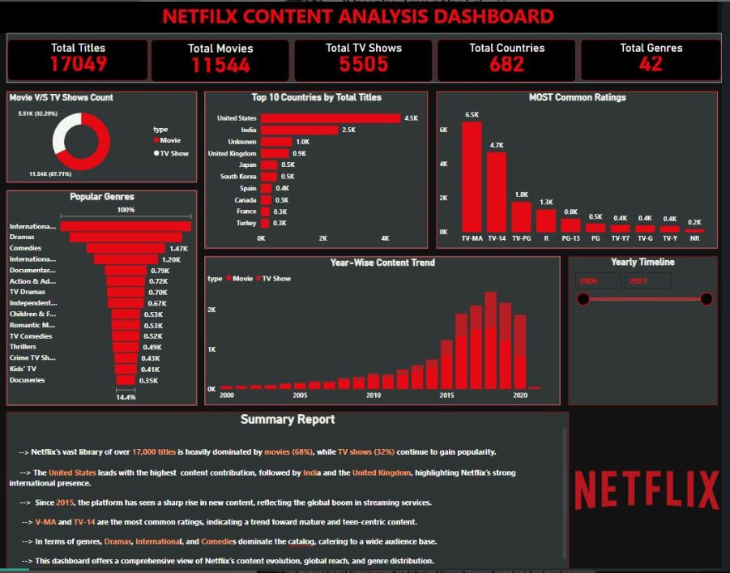

# 🎬 Netflix Content Analysis Dashboard – Power BI

This Power BI project presents an interactive analysis of Netflix's content library, offering valuable insights into the platform's distribution of movies and TV shows, genre popularity, ratings, and international presence from 2000 to 2021.

---

## 📌 Project Overview

Netflix, as one of the world's leading streaming platforms, offers a massive collection of titles across various countries and genres. This dashboard explores patterns in Netflix's content catalog to understand:

- Growth of content over the years
- Regional distribution across countries
- Movie vs. TV show ratio
- Popular genres and rating classifications

---

## 📊 Key Metrics

| Metric                | Value       |
|-----------------------|-------------|
| **Total Titles**      | 17,049      |
| **Total Movies**      | 11,544 (68%)|
| **Total TV Shows**    | 5,505 (32%) |
| **Total Countries**   | 682         |
| **Total Genres**      | 42          |

---

## 🌟 Key Insights

- 🎥 **Movies** dominate the content library with 68% share, while **TV Shows** contribute 32%.
- 🌍 **United States**, **India**, and **United Kingdom** are the top 3 countries in terms of title contribution.
- 📈 There has been a dramatic increase in content since **2015**, signaling Netflix’s global expansion.
- 🎭 Most popular genres include **Dramas**, **International**, and **Comedies**.
- 🔞 **TV-MA** and **TV-14** are the most common content ratings, targeting mature and teen audiences.

---

## 🖼️ Dashboard Preview

---

## 📁 Repository Structure

netflix-content-analysis/
├── Netflix_Content_Analysis.pbix # Power BI file
├── README.md # Project documentation
└── screenshots/
└── netflix-dashboard.png # Dashboard image

---

## 🧰 Tools & Technologies

- **Power BI Desktop**
- **DAX** (Data Analysis Expressions)
- **Power Query Editor**
- Custom visuals (e.g., donut charts, clustered bars)
- Slicers and year-range filters

---

## 💼 Use Case

This dashboard is ideal for:

- 📊 Data analysts exploring entertainment industry trends
- 📺 Streaming content strategists
- 📚 Power BI learners building strong portfolios
- 💼 Recruiters assessing Power BI storytelling and visualization skills

---

## 👩‍💻 Author

**Khushi Tripathi**  
🔗 [LinkedIn](https://www.linkedin.com/posts/khushi-tripathi-b9a64125a_powerbi-powerbi-datavisualization-activity-7330207889774612480--KQv?utm_source=share&utm_medium=member_desktop&rcm=ACoAAD_PeWYBZlkl5Vi9NBj4106xDqBMLvYlZ4Q)  
🐱 [GitHub](https://github.com/KhushiTripathi21)

---

## 📄 License

This project is licensed under the [MIT License](LICENSE).

---

## 🔗 Project Link

Access the full project here:  
**[https://github.com/KhushiTripathi21/netflix-content-analysis](https://github.com/KhushiTripathi21/netflix-content-analysis)**

---

